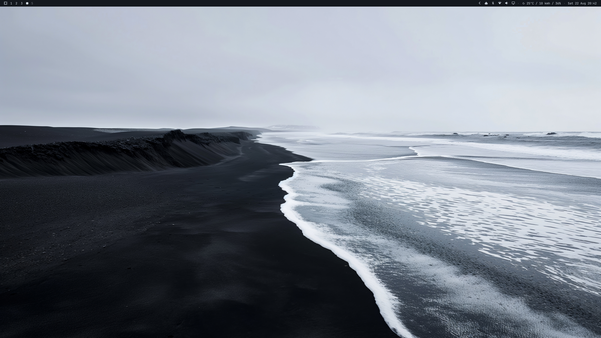
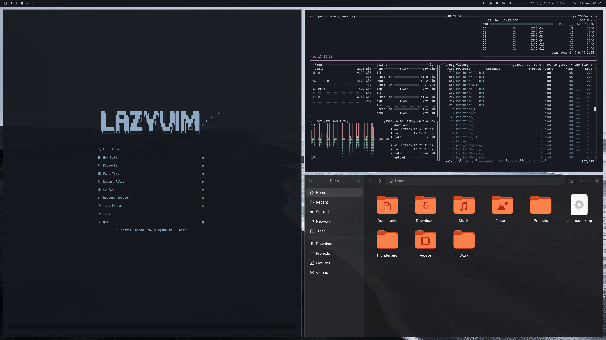

# Black Sand

A cold, near-monochrome Omarchy theme drawn from a black volcanic beach under
an overcast sky. Very dark grey backgrounds, an almost-white accent, and
deliberately desaturated ANSI colours so terminal output stays readable
without breaking the mood.





## Install

```bash
omarchy theme install https://github.com/pkovzz/omarchy-black-sand-theme.git
```

## Palette

Every colour is sampled from the background photograph.

| Role | Colour | Sampled from |
|------|--------|--------------|
| `background` | `#14181E` | dry black sand |
| `dark_background` | `#0E1116` | — |
| `darker_background` | `#080B10` | deepest foreground sand |
| `lighter_background` | `#1C2026` | mid-tone sand near the waterline |
| `foreground` / `accent` | `#CED6E0` | overcast sky and sea foam |
| `light_foreground` | `#AFB8C7` | — |
| `dark_foreground` | `#6C7987` | foam over wet sand |
| `muted` | `#525D6A` | wet sand under shallow water |
| `selection` | `#363F4A` | dune shadow |

The ANSI colours are held at low saturation (~22–30%) and a shared lightness
band, so syntax highlighting and `git diff` read clearly while staying inside
the cold grey-blue cast of the photo.

| | normal | bright |
|---|---|---|
| red | `#BD8489` | `#D2A2A6` |
| yellow | `#C3B798` | `#D8CFB6` |
| green | `#89B39B` | `#A6CAB5` |
| cyan | `#8FB5BD` | `#ACCCD2` |
| blue | `#8EA7C2` | `#ADC0D7` |
| magenta | `#BC9BBF` | `#D3B9D5` |
| orange | `#C19F8B` | — |
| brown | `#876F5E` | — |

## Contents

- `colors.toml` — the palette; Omarchy templates it out to Hyprland, the shell, terminals and more
- `icons.theme` — `Yaru-dark`
- `shell.lock.toml` — lock screen text and border colours
- `unlock.png` — the Omarchy wordmark in the accent colour
- `backgrounds/` — the wallpaper
- `preview_desktop.png` — the bare desktop
- `preview.png` — the theme in use; also what the theme switcher shows

No `neovim.lua` or `vscode.json`: those pin a named upstream colorscheme
plugin rather than reading `colors.toml`, and no published scheme matches this
palette. Both applications fall back to Omarchy's defaults.
